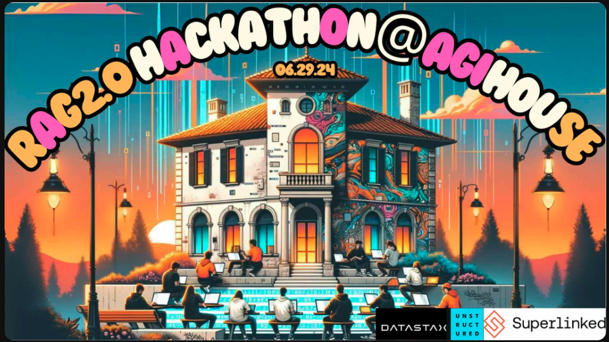
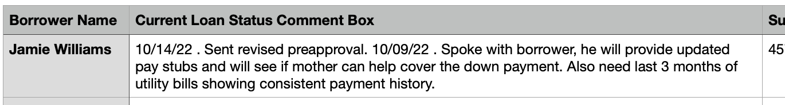
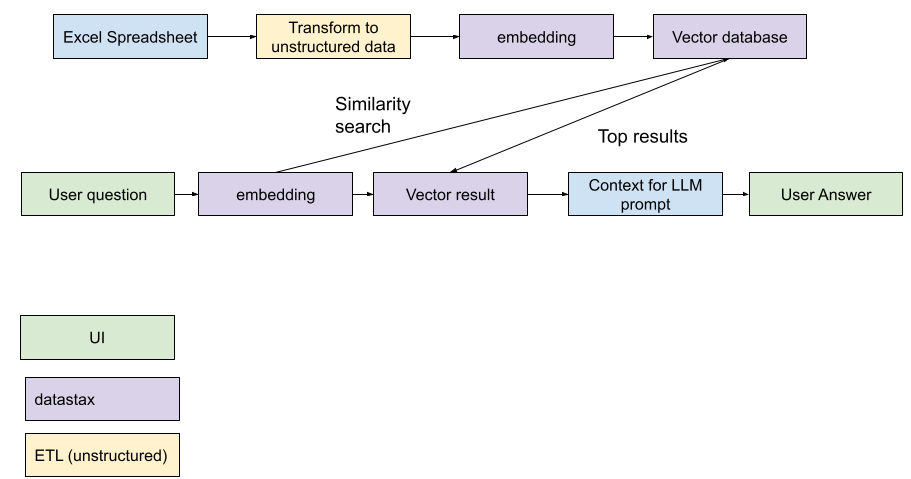

# CRM Optimizer Chatbot Project

## Background 

### Hackathon
We created this project as part of the RAG 2.0 Hackathon @ Agihouse on June 29, 2024 

### Team 
- Dima Havryliuk 
- Dimitris Moraitis
- Siya Goel 
- Rachel Beddor 

### Project
- Many small businesses keep records on excel spreadsheets. 
- There are many reasons these small businesses choose not to use a CRM tool like Salesforce, including: 
    - They don't have enough staff (or staff with the right skillset) to maintain a complex CRM like Salesforce
    - The cost of a CRM is prohibitive for them 
- Our project bridges this gap for these small businesses. Businesses can use their private excel spreadsheets in combination with a LLM-enabled chatbot to ask questions and gain insights into their data. 

### Mortgage Lender Example 
- For this sample, we are using data that simulates call records from a sales representative at a mortgage lender
- You can see the data in the [Data/masked_data.csv](Data/masked_data.csv) file 
- Here's an example 
- In this example, the sales representative has been repeatedly in contact with Jamie Williams to try to get them approved for a mortgage. The sales representative has been taking notes of the conversation they are having with Jamie in the excel spreadsheet. 

### Demo 

    <video width="320" height="240" controls>
        <source src="img/demo.mp4" type="video/mp4">
        Your browser does not support the video tag.
    </video>

### Architecture 

- this uses a RAG architecture
- it works by uploading the private spreadsheet data to a vector database (astra db by datastax)
- when a user queries, the query is issued against the vector database, which provides context for the LLM
- this way the chatbot result gives you that silky smooth chatGPT experience, but uses data relevant to the business! 

### What this code does (and how to run it)
#### 0. Prerequisites 
- [pipenv](https://pipenv.pypa.io/en/latest/) enables us to manage dependencies more easily - so check that out and consider using it to manage your libraries! 
- we already have the pipfile for pipenv included in this repository, so you should be able to get the same dependencies by simply running the following in the same directory as the Pipfile 
    - `pipenv install` to install the packages
    - `pipenv shell` to launch the shell 
- You'll also need a datastax astra db free trial account. Set it up [astra db quickstart](https://docs.datastax.com/en/astra-db-serverless/get-started/quickstart.html) and add the API key and endpoint to your environment variables. 
    - `export DATASTAX_API_KEY="your api key"`
    - `export DATASTAX_API_ENDPOINT="your api endpoint"` 
- You will also need an Open AI API Key - here's a [quickstart](https://platform.openai.com/docs/quickstart) to help you get started
    - `export OPENAI_API_KEY='your-api-key-here'`

#### 1. Adding Data to the Data Store (Data Folder)
- the code for adding the data to the data store is included in a jupyter notebook [Add_Data_to_Data_Store.ipynb](Data/Add_Data_to_Data_Store.ipynb)
- the masked data is included [masked_data.csv](Data/masked_data.csv)
- Check out the markdown sections of the jupyter notebook for a play-by-play on what exactly this code does

#### 2. Run the App (Chatbot folder)
- we built upon code from https://github.com/mrzjy/ChatbotUI/ for this section, so check that out if you're interested!
- It uses [flask](https://flask.palletsprojects.com/en/3.0.x/) to launch a webpage with a chat UI (similar to our fav, chatGPT!)
- It integrates with OpenAI and your astradb instance 
- Run it with `python3 app.py` 
- Navigate to [http://127.0.0.1:54321/](http://127.0.0.1:54321/) to see the webpage (check the output of your terminal for the exact url)

### Limitations 
1. **dataset is so small it can fit in LLM prompt, which makes our app appear more performant than it probably would be at scale**
-  our dataset is very small, so it's possible that the entire dataset could fit in the context for the LLM. This defeats the purpose of the vector query (RAG) as the LLM can process the entire dataset directly. 
    - If you want to explore with a larger dataset, you can try generating more data with chatGPT  
    - You can also reduce the amount of result set from the vector query that is included in the context for the LLM query. This will make it a more realistic simulation of a prod case, because the LLM isn't getting very many results in the context 
        - to do that, change the `limit` in this section in the `app.py` code:     `results = collection0.find({}, sort={"$vector": query_vector}, limit=5)` 
        - (the `limit` is the number of results returned from the vector search)
    
2. **analytical style queries on the whole dataset like "who has the highest income"** 
- I'm not really sure how this would work if you asked the question "who has the highest income?" - does the vector db just do a semantic similarity with "highest" or does it actually know to interpret that and then do a RDBMS ` order by` style query on the data? If you know the answer to this, please reach out and teach me 😃😃😃
    - perhaps this is one of the challenges of combining unstructured and structured data in a RAG application, because our application still needs the type of structured SQL-ish query like "who has the highest income?" 

